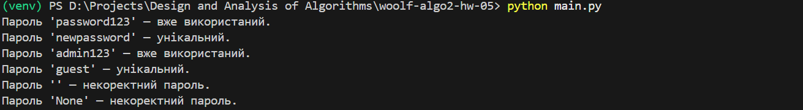
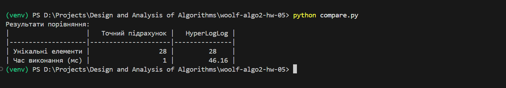

# woolf-algo2-hw-05

# Домашнє завдання 5 — Алгоритми роботи з великими даними

## Репозиторій: `https://github.com/vikkrat/woolf-algo2-hw-05`

## Структура проєкту
```
goit-algo2-hw-05/
├── bloom_filter.py
├── ip_counter.py
├── main.py
├── compare.py
├── requirements.txt
├── bloom_run_main.png
├── hll_run_compare.png
└── README.md
```

---

## Підготовка
## Використання віртуального середовища
- Створення:
`python -m venv venv`

- Активація:

Windows: `venv\Scripts\activate` Linux/macOS: `source venv/bin/activate`

- Встановлення залежностей:

`pip install -r requirements.txt`

---

## Завдання 1. Перевірка унікальності паролів за допомогою фільтра Блума

Реалізовано клас `BloomFilter` з можливістю додавання та перевірки елементів.  
Також реалізовано функцію `check_password_uniqueness`, яка перевіряє список нових паролів і повертає результат для кожного.

### Запуск
`python main.py`

### Результат виконання:
  

---

## Завдання 2. Порівняння точного підрахунку та HyperLogLog
Створено функції для:
- Точного підрахунку унікальних IP-адрес за допомогою set
- Наближеного підрахунку за допомогою HyperLogLog
- Порівняння реалізовано з використанням бібліотеки tabulate.

## Запуск

`python compare.py`

## Результат виконання:
  

---


